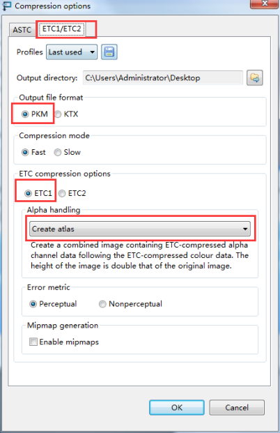
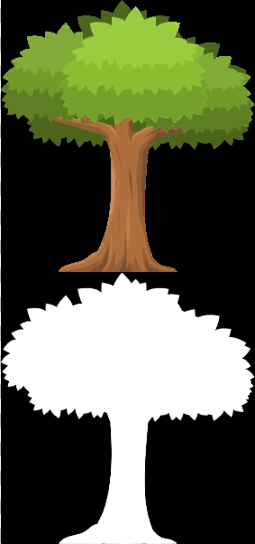

使用Mali Texture Compression Tool生成带Alpha通道的ETC1格式的图片，设置如下



处理后生成一个.pkm的图片，效果如下



使用自定义的Alpha分离Shader  

顶点着色器

```glsl
module.exports = 
`
attribute vec4 a_position; 
attribute vec2 a_texCoord; 
attribute vec4 a_color;  
varying vec4 v_fragmentColor; 
varying vec2 v_texCoord; 
varying vec2 v_alphaCoord;
void main() 
{ 
    gl_Position = CC_PMatrix * a_position;
    v_fragmentColor = a_color; 
    v_texCoord = a_texCoord; 
}
`
```

片段着色器

```glsl
module.exports = 
`
precision lowp float;
varying vec4 v_fragmentColor; 
varying vec2 v_texCoord; 
varying vec2 v_alphaCoord;
void main() 
{ 
    vec4 v4Colour = texture2D(CC_Texture0, v_texCoord);
    v4Colour.a = texture2D(CC_Texture0, vec2(0.0, 0.5) + v_texCoord).r;
    gl_FragColor = v_fragmentColor * v4Colour; 
}
`
```

Build出工程，将build/jsb-default/res/raw-assets目录下未压缩的图片替换为经过处理的图片，打包出apk就可以了


[干货分享：Creator使用压缩纹理](http://forum.cocos.com/t/creator/47206)