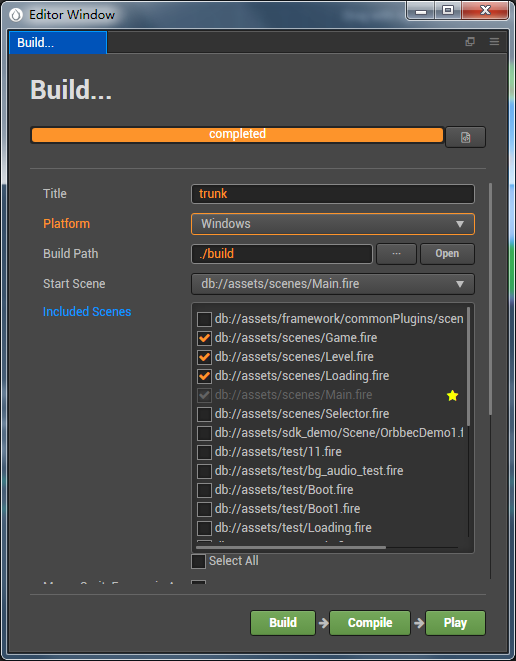
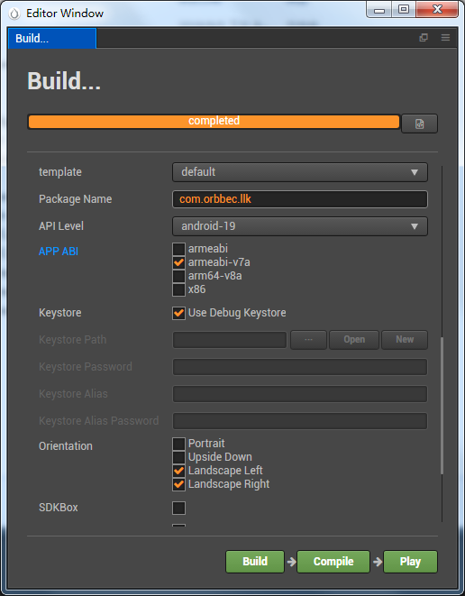
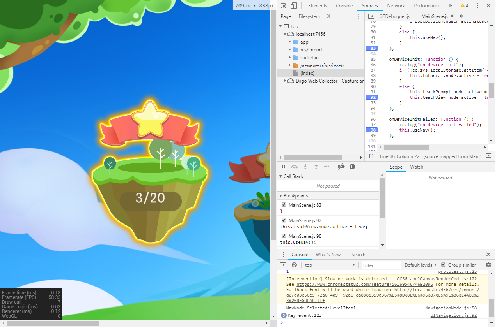
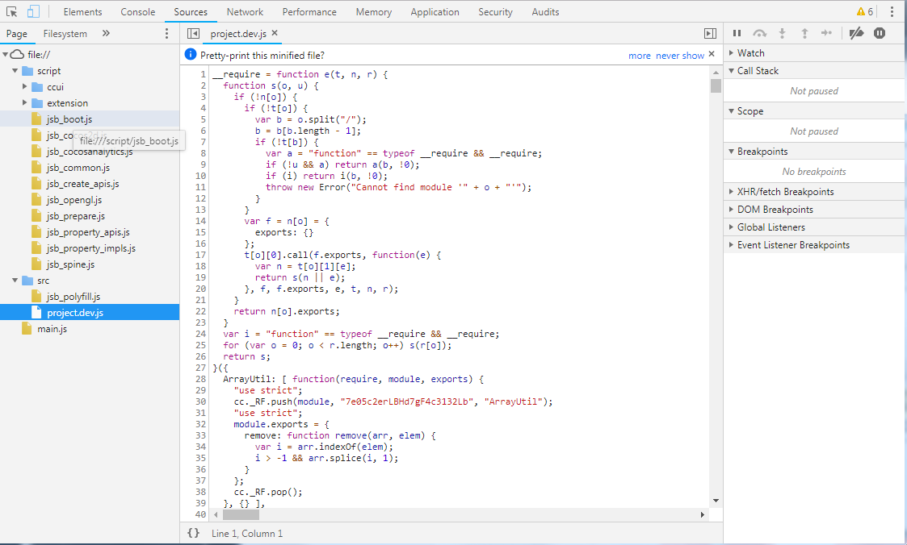
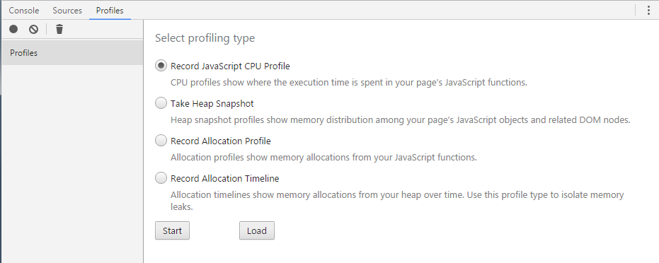
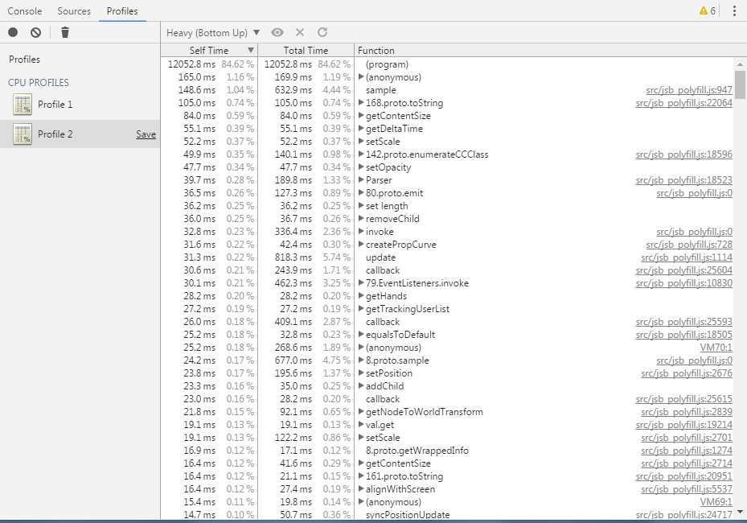
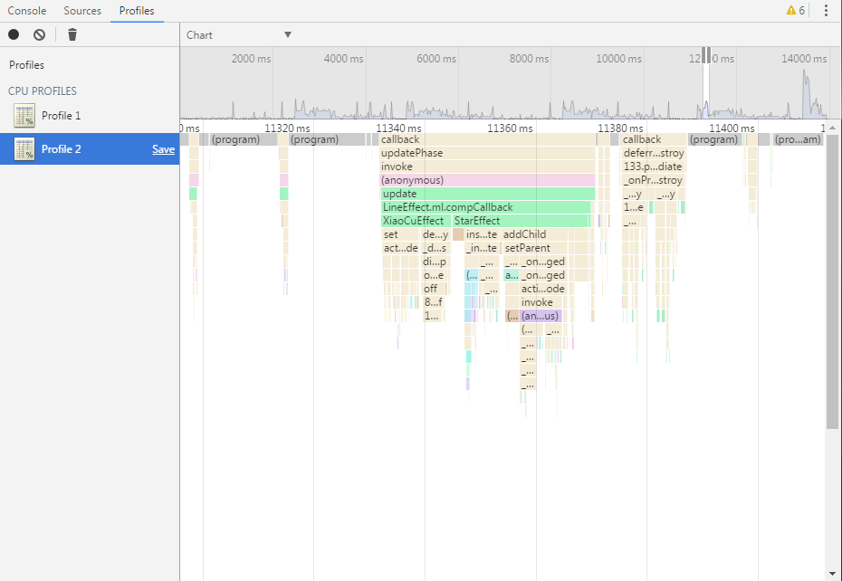
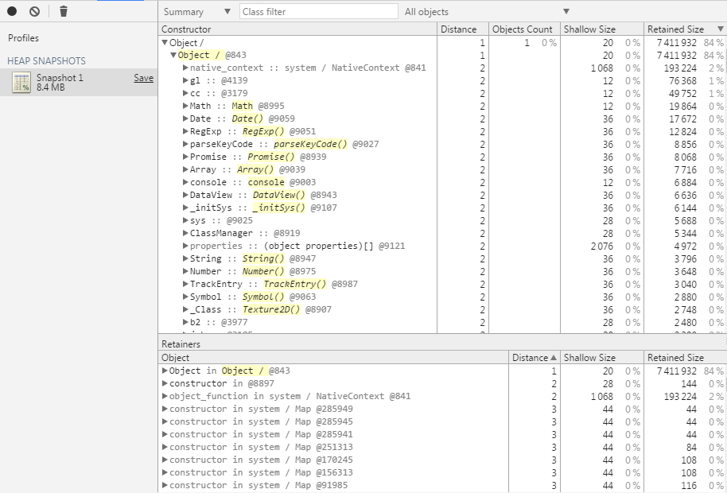
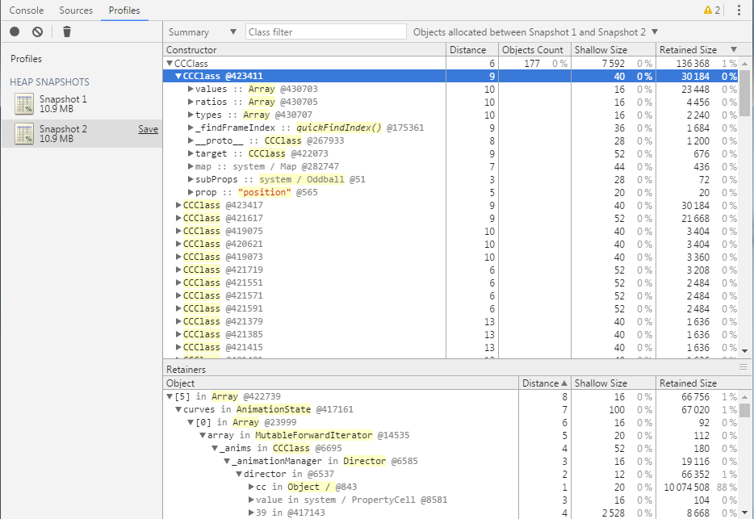

# Cocos Creator使用经验总结

## 配置

### 配置VSCode

Cocos官方推荐使用VSCode来编辑脚本，可以享受语法高亮、只能代码提示等功能（事实证明没*用）

首先安装VSCode，完成后从File->Settings打开Editor Windows，在Data Editor中设置好

### 配置Android环境

搭建Android编译环境需要JDK、NDK和Android SDK（ANT可以不用）

Android SDK的API Level推荐19，NDK推荐r10e

按照下图所示配置好相应路径

### 配置Windows编译环境

安装Python 2.7.5以上版本，但是不要使用3.x版本

下载Visual Studio2015或2017，安装（需要勾选VC++组件）

## 构建

### 构建Windows工程

通过菜单Project->Build打开构建面板，选择Windows平台，勾选需要构建的场景，template选择default，VS Version选择已安装的VS版本，非Release版本可以勾上Debug选项

点击Build构建出工程，在工程的build\jsb-default\frameworks\runtime-src\proj.win32文件夹里就是生产好的VS工程，直接用相应版本的VS打开就可以了

### 构建Android工程

在构建面板选择Android平台，设置好包名，API Level，需要在SDK Manager中下载好才可以选择相应API Level，APP ABI可以选择armeabi-v7a，也可以不勾选，非Release版本可以直接勾选Use Debug Keystore

设置好后点击Build构建工程，完成后点击Compile，如果没有报错，就可以在build\jsb-default\frameworks\runtime-src\proj.android-studio\app\build\outputs\apk\debug目录中找到apk文件，可以手动安装，也可以点击Play自动安装

> 注意：很多人在Compile时都遇到过Error:Connection timed out问题。这是由于下载Gradle时超时导致，解决办法可以参考https://www.jianshu.com/p/19983d4def67

## 运行

### 运行Windows工程

构建出工程后直接在VS中打开，和普通的VC++工程一样编译运行就可以了

### 运行Android工程

参考构建Android工程

## 调试

### web平台调试

选择Browser然后点击运行按钮，就可以在浏览器中打开当前场景

推荐使用Chrome进行调试，按F12打开开发面板，可以打断点，单步执行，查看日志输出，还可以查看性能和内存占用

### Windows平台调试

运行Windows工程

打开Chrome浏览器，输入chrome-devtools://devtools/bundled/inspector.html?v8only=true&ws=127.0.0.1:5086/00010002-0003-4004-8005-000600070008就可以看到调试面板，注意这里的调试脚本是project.dev.js，而不是我们写代码的JS文件，这是因为CocosCreator打包的时候会将所有的脚本都放到project.dev.js中，并做相应的优化，所以我们调试的时候要先在project.dev.js文件中调试，找到问题后再到相应的脚本中修复

### Android平台调试

先在Android机器上打开游戏

和Windows平台类似，输入chrome-devtools://devtools/bundled/inspector.html?v8only=true&ws={IP}:5086/00010002-0003-4004-8005-000600070008，但是IP要换成Android机器的IP，就可以调试了

## 性能分析

可以使用Chrome来分析JS脚本的性能，查看内存分配等

我们主要使用前两个功能来分析，首先需要使用调试方法连接到设备

### JS脚本CPU性能分析

选择Record JavaScript CPU Profile来分析脚本性能，在需要分析性能的地方点击开始，完成后点击停止，可以通过排序及图表等方式来显示性能消耗

### 内存分析

可以通过内存快照来查看当前的内存分配情况，还可以通过查看两次内存快照之间分配的内存来分析是否有内存泄漏，或者存在资源释放问题

