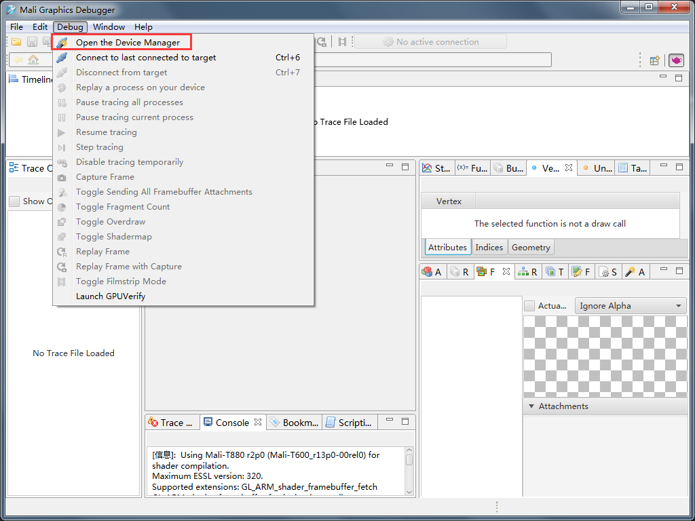
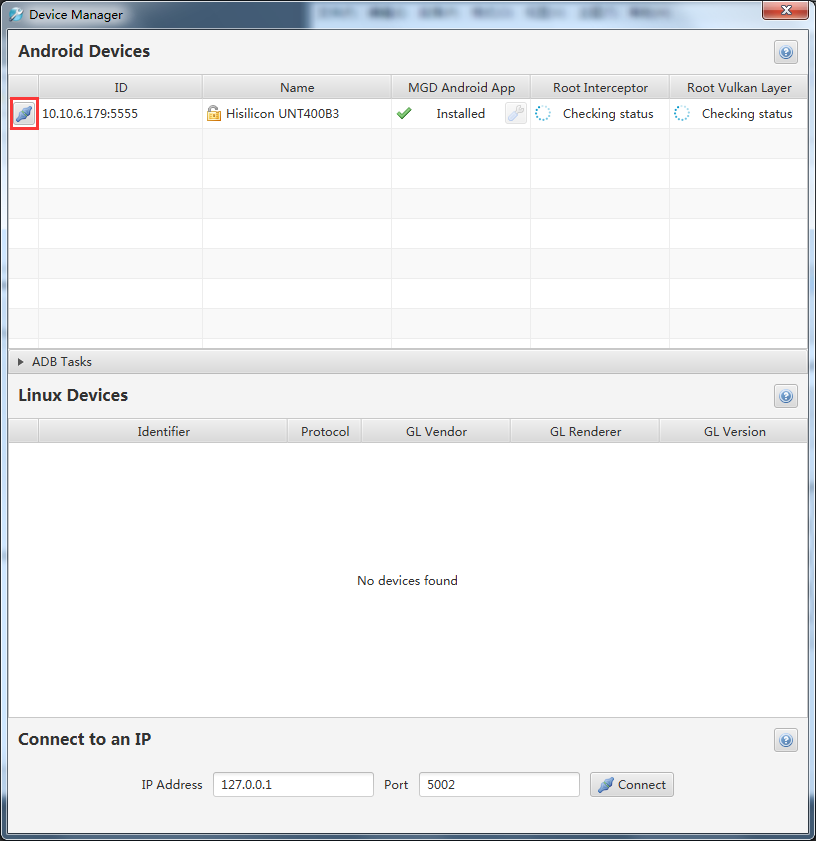
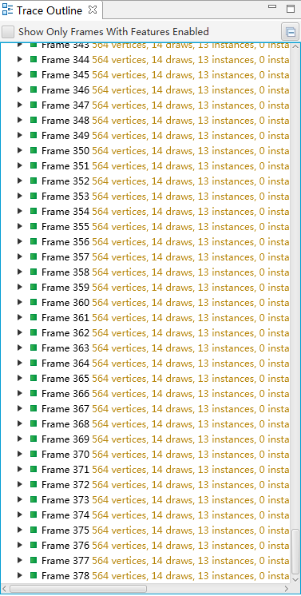
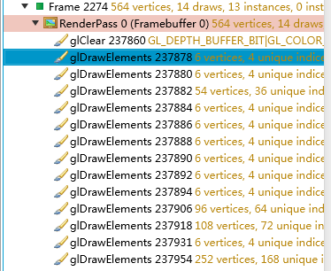
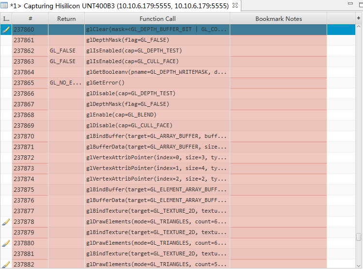
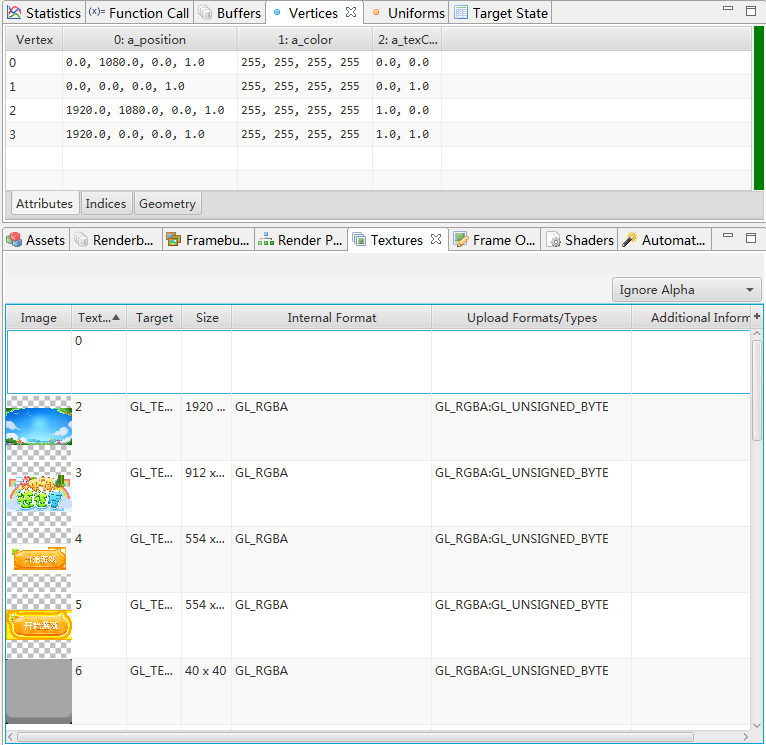
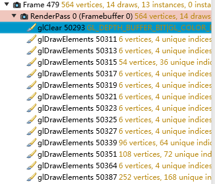
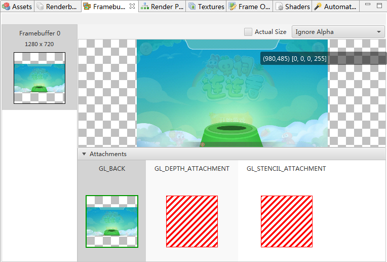

# Cocos Creator图形性能分析

这里我们使用的工具是Mali Graphics Debugger，具体安装方法可以参考官网教程，这里只讲使用方法

###### 1.连接设备：点击菜单Debug->Open the Device Manager打开设备管理器面板

###### 2.点击Connect按钮连接到设备（需要先用adb连接）

###### 3.打开安卓设备中的Mali Graphics Debugger，选择需要调试的App打开

###### 4.左侧的面板会显示从程序启动到当前的所有帧

###### 5.点击其中的一帧展开，可以看到该帧的所有DrawCall

###### 6.中间的面板显示的是从游戏启动到当前帧所有的GL命令

###### 7.右侧的面板可以看到很多详细的信息，如调用的GL函数，顶点，Texture，Shader等信息

###### 8.点击相机按钮可以截取一帧进行深入分析

该帧图标也会显示成一个相机，可以对该帧进行逐DrawCall调试

