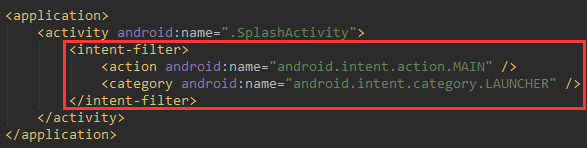
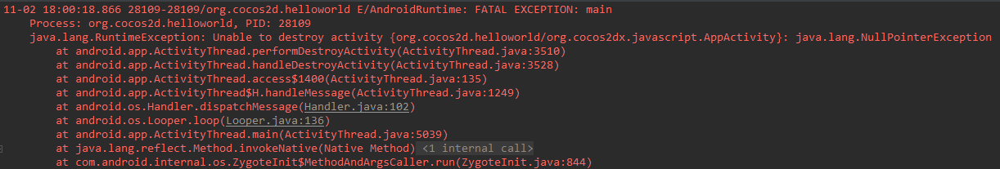

# Cocos Creator闪屏开发总结

**问题：**

如何从Splash的aar库中启动Activity

**解决办法：**

在Splash库工程的AndroidManifest.xml中的Activity加入下面的启动项，并且去掉Cocos工程中启动Activity的相应设置



**问题：**

如何引入aar库

**解决办法 ：**

在Cocos工程的build.gradle中的android加入

```
repositories {
    flatDir {
        dirs 'libs'
    }
}
```

dependencies中加入

```
implementation(name: 'splash-debug', ext: 'aar')
```

**问题：**

在从闪屏跳转到Cocos的Activity时出现下面的错误，然后闪退



**解决办法：**

在Cocos工程的AndroidManifest.xml中的org.cocos2dx.javascript.AppActivity加入

`android:launchMode="singleInstance"`


[[cocos android 版本的activity 跳转到 原生andriod activuty,报错](https://forum.cocos.com/t/cocos-android-activity-andriod-activuty/57422)](https://forum.cocos.com/t/cocos-android-activity-andriod-activuty/57422/26)