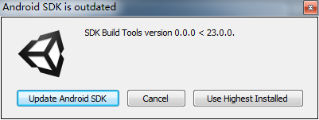

问题：SDK Build Tools version x.x.x < x.x.x.

 

原因：没有安装Android SDK Build Tools或者SDK Build Tools的版本小于指定版本时出现该错误

解决方法：下载大于指定版本的SDK Build Tools

 问题：Unable to list target platforms. Please make sure the android sdk path is correct.

 

原因：Android SDK Tools 25.2.3引入了新的命令行工具`sdkmanager`来管理Android SDK包，并且在Android SDK Tools 25.3.0中移除了`android`及其它被弃用的命令行工具，但是一些老版本的Unity，如：5.5.2p2, 5.6.0b11, 2017.1.0a3需要使用它们来构建

解决方法：

- 使用小于25.3.0版本的Android SDK Tools来构建

- 升级到一些较新版本的Unity，如：5.4.5p2, 5.5.3p3, 5.6.0p3, 2017.1.0b3

- 下载"tools_r25.2.3-windows.zip"，解压后移除并替换掉原SDK目录中的tools文件夹

 

[ANDROID BUILD FAILS WHEN THE LATEST ANDROID SDK TOOLS 25.3.1 VERSION IS USED](https://issuetracker.unity3d.com/issues/android-build-fails-when-the-latest-android-sdk-tools-25-dot-3-1-version-is-used)

[Build fails with "Invalid command and android" after upgrading Android SDK Tools to latest (25.3.1)](https://forum.unity.com/threads/build-fails-with-invalid-command-and-android-after-upgrading-android-sdk-tools-to-latest-25-3-1.460911/)

[Unable to list target platforms. When I try to build to Andriod on Mac](https://answers.unity.com/questions/1320634/unable-to-list-target-platforms-when-i-try-to-buil.html)