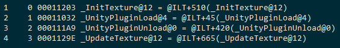

在开发Native插件时，按照下面的方式创建了UnityPluginLoad和UnityPluginUnload函数，但是却没有被调用

```c++
extern "C" void UNITY_INTERFACE_EXPORT UNITY_INTERFACE_API UnityPluginLoad(IUnityInterfaces* unityInterfaces)
{
	s_UnityInterfaces = unityInterfaces;
	s_Graphics = unityInterfaces->Get<IUnityGraphicsD3D11>();
	s_Device = s_Graphics->GetDevice();
}

extern "C" void UNITY_INTERFACE_EXPORT UNITY_INTERFACE_API UnityPluginUnload()
{
	return;
}
```

使用dumpbin查看导出的符号，发现就算我们已经使用了__declspec(dllexport)来声明UnityPluginLoad和UnityPluginUnload，编译器最后还是对导出的符号进行了处理。



为什么会出现这种情况呢。这是因为使用__stdcall的方式调用函数，在以C编译导出的时候，会在函数前面加入下划线，并在函数后面加入@和参数总大小的字节数。


我们将InitTexture和UpdateTexture函数改成__cdecl的方式调用，发现编译器没有对导出的符号进行处理了


但是UnityPluginLoad和UnityPluginUnload的声明不允许我们这样做，我们只能采用另一种方式来导出符号了，使用def文件导出。我们创建一个.def文件并在在其中这样声明

```
LIBRARY

EXPORTS
	UnityPluginLoad
	UnityPluginUnload
	InitTexture
	UpdateTexture
```

表示导出UnityPluginLoad，UnityPluginUnload，InitTexture，UpdateTexture这几个函数，并且不对它们做任何处理，可以看到导出的符号都没有进行过处理。


[UnityPluginLoad not called in native plugin](https://forum.unity.com/threads/unitypluginload-not-called-in-native-plugin.436207/)

[为Unity3D编写Low-level Native Plugin（OpenGL Renderer Plugin）作渲染](https://www.cnblogs.com/chandler00x/p/6264274.html)

[dll的def文件与__declspec(dllexport)导出函数方式比较](https://www.cnblogs.com/zhangxiaosong/p/3300861.html)

[关于extern "C"（详细剖析）](https://www.cnblogs.com/TenosDoIt/p/3163621.html)

[EXPORTS](https://docs.microsoft.com/en-us/cpp/build/reference/exports?view=vs-2017)

[VS自带工具：dumpbin的使用](https://www.cnblogs.com/dyllove98/p/3146922.html)