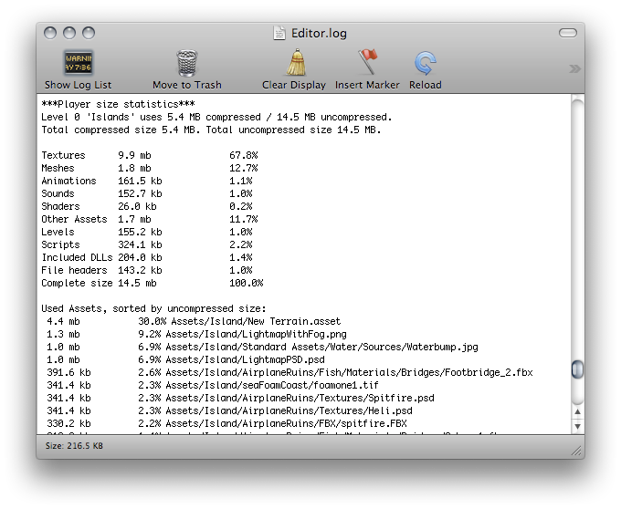

在打包完成后可以从控制台右上角的菜单Open Editor Log打开Unity
Editor的日志，可以看到打包的详细信息，里面记录了打包的所有资源文件的大小，可以发现哪些资源文件占用了较多的空间

一般，像纹理图片，音乐和视频会占用大部分的空间，而脚本，关卡和shader通常都可以忽略不计。

有几点需要注意：

Unity会重新编码导入的资源文件为它自己的格式，和选择的源文件的格式并没有关系。举个例子，如果你有一个多图层的Photoshop纹理在Unity工程中，它会被压平和压缩，这和将这个纹理导出为PNG格式的文件再导入到Unity中并没有什么不同，所以在开发中可以选择你最方便使用的格式。

Unity在编译的时候会去掉大多数没有用到的资源，因此你不需要手动从工程中删除资源。只有脚本文件和在Resources中的资源文件不会移除。考虑到这一点，你应该确保在Resources文件夹中的资源只有你在游戏中真正需要用到的。你可以考虑用AssetsBundle代替Resources动态加载资源文件来减少包的大小。

减少包大小的建议

纹理

通常纹理会咋用大部分的空间。所以第一件事就是使用压缩的纹理格式(DXT(桌面平台)或PVRTC)。如果大小并没有明显下降，尝试减少纹理的尺寸。你并不需要从原文件来修改尺寸，简单的在工程中选择纹理然后在Import
Setting中设置Max Size。

Unity在导入时默认压缩所有纹理。你可以在Preferences中关闭压缩，但是所有纹理仍然会在编译时压缩，无论这个设置怎样。\

网格和动画\

网格和动画片段将会压缩使它们在你的游戏中占用更小的空间。压缩可以在Mesh
Import Setting中打开。

纹理和动画的压缩是量化的，意思是它可以减少空间占用但是会带来一些不确定因素。实验看哪个程度的压缩是你的模型可以接受的。

注意网格压缩只会使数据文件更小而不会在运行是使用更少的内存。动画关键帧可以减少数据文件和运行时的内存占用，通常你应该始终打开。

DLL

默认情况下，Unity在编译时只会引入以下的DLL：

mscorlib.dll

Boo.Lang.dll

UnityScrity.Lang.dll

UnityEngine.dll

编译player时，你应该避免任何对System.dll或System.Xml.dll的引用。Unity默认不会在编译的player中引入它们，如果你使用了这些类它们将会被引入。这些DLL将增加大约1M左右的存储空大小。如果你需要在你的游戏中解析XML，你可以使用像Mono.Xml.zip之类更小的库来代替系统库。大部分泛型容器都在mscorlib中，Stack&lt;&gt;和一小部分其他的在System.dll中。因此如果可能的话你需要避免引用。

减少Mobile .Net库大小\

Unity在一些移动设备上支持两种.NET API兼容级别：.NET 2.0和.NET
2.0子集。你可以在Player Setting中选择合适的级别。

.Net 2.0 API类似于完整的.NET 2.0
API，实现了其中大部分功能，因此这个选项对已有的.NET代码提供了最好的兼容性。然而，对于许多游戏来说完整的库并不是必须的，而多余的代码占用了宝贵的内存空间。

为了避免内存消耗，Unity也提供了.NET 2.0 Subset。这非常类似于Mono
"monotouch"，因此许多在"monotouch"中的限制也存在与Unity的.NET
2.0中。许多游戏中通常不需要的功能被移除来节省内存。然而这意味着那些以来这个例程的代码将不能正常工作。这个选项对优化很有用，单你应该检查现有的代码是否仍然可以工作。

\

\

