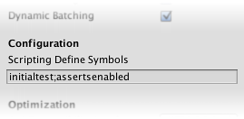

平台定义
========

Unity支持的平台定义有：
-----------------------

| Property:                | Function:                                                                                                                                                                          |
|--------------------------|------------------------------------------------------------------------------------------------------------------------------------------------------------------------------------|
| UNITY\_EDITOR            | Define for calling Unity Editor scripts from your game code.                                                                                                                       |
| UNITY\_EDITOR\_WIN       | Platform define for editor code on Windows.                                                                                                                                        |
| UNITY\_EDITOR\_OSX       | Platform define for editor code on Mac OSX.                                                                                                                                        |
| UNITY\_STANDALONE\_OSX   | Platform define for compiling/executing code specifically for Mac OS (This includes Universal, PPC and Intel architectures).                                                       |
| UNITY\_STANDALONE\_WIN   | Use this when you want to compile/execute code for Windows stand alone applications.                                                                                               |
| UNITY\_STANDALONE\_LINUX | Use this when you want to compile/execute code for Linux stand alone applications.                                                                                                 |
| UNITY\_STANDALONE        | Use this to compile/execute code for any standalone platform (Mac, Windows or Linux).                                                                                              |
| UNITY\_WEBPLAYER         | Platform define for web player content (this includes Windows and Mac Web player executables).                                                                                     |
| UNITY\_WII               | Platform define for compiling/executing code for the Wii console.                                                                                                                  |
| UNITY\_IOS               | Platform define for compiling/executing code for the iOS platform.                                                                                                                 |
| UNITY\_IPHONE            | Deprecated. Use UNITY\_IOS instead.                                                                                                                                                |
| UNITY\_ANDROID           | Platform define for the Android platform.                                                                                                                                          |
| UNITY\_PS3               | Platform define for running PlayStation 3 code.                                                                                                                                    |
| UNITY\_PS4               | Platform define for running PlayStation 4 code.                                                                                                                                    |
| UNITY\_XBOX360           | Platform define for executing Xbox 360 code.                                                                                                                                       |
| UNITY\_XBOXONE           | Platform define for executing Xbox One code.                                                                                                                                       |
| UNITY\_BLACKBERRY        | Platform define for a Blackberry10 device.                                                                                                                                         |
| UNITY\_TIZEN             | Platform define for the Tizen platform.                                                                                                                                            |
| UNITY\_WP8               | Platform define for Windows Phone 8.                                                                                                                                               |
| UNITY\_WP8\_1            | Platform define for Windows Phone 8.1.                                                                                                                                             |
| UNITY\_WSA               | Platform define for Windows Store Apps (additionally NETFX\_CORE is defined when compiling C\# files against .NET Core).                                                           |
| UNITY\_WSA\_8\_0         | Platform define for Windows Store Apps when targeting SDK 8.0.                                                                                                                     |
| UNITY\_WSA\_8\_1         | Platform define for Windows Store Apps when targeting SDK 8.1.                                                                                                                     |
| UNITY\_WSA\_10\_0        | Platform define for Windows Store Apps when targeting Universal Windows 10 Apps (additionally WINDOWS\_UWP and NETFX\_CORE is defined when compiling C\# files against .NET Core). |
| UNITY\_WINRT             | Equivalent to UNITY\_WP8 | UNITY\_WSA.                                                                                                                                             |
| UNITY\_WINRT\_8\_0       | Equivalent to UNITY\_WP8 | UNITY\_WSA\_8\_0.                                                                                                                                       |
| UNITY\_WINRT\_8\_1       | Equivalent to UNITY\_WP\_8\_1 | UNITY\_WSA\_8\_1. It’s also defined when compiling against Universal SDK 8.1.                                                                      |
| UNITY\_WINRT\_10\_0      | Same as UNITY\_WSA\_10\_0                                                                                                                                                          |
| UNITY\_WEBGL             | Platform define for WebGL.                                                                                                                                                         |
| UNITY\_ANALYTICS         | Define for calling Unity Analytics methods from your game code. Version 5.2 and above.                                                                                             |

与Unity版本的相关定义有：
-------------------------

|                |                                                     |
|----------------|-----------------------------------------------------|
| UNITY\_2\_6    | Platform define for the major version of Unity 2.6. |
| UNITY\_2\_6\_1 | Platform define for specific version 2.6.1.         |
| UNITY\_3\_0    | Platform define for the major version of Unity 3.0. |
| UNITY\_3\_0\_0 | Platform define for specific version 3.0.0.         |
| UNITY\_3\_1    | Platform define for major version of Unity 3.1.     |
| UNITY\_3\_2    | Platform define for major version of Unity 3.2.     |
| UNITY\_3\_3    | Platform define for major version of Unity 3.3.     |
| UNITY\_3\_4    | Platform define for major version of Unity 3.4.     |
| UNITY\_3\_5    | Platform define for major version of Unity 3.5.     |
| UNITY\_4\_0    | Platform define for major version of Unity 4.0.     |
| UNITY\_4\_0\_1 | Platform define for specific version 4.0.1.         |
| UNITY\_4\_1    | Platform define for major version of Unity 4.1.     |
| UNITY\_4\_2    | Platform define for major version of Unity 4.2.     |
| UNITY\_4\_3    | Platform define for major version of Unity 4.3.     |
| UNITY\_4\_5    | Platform define for major version of Unity 4.5.     |
| UNITY\_4\_6    | Platform define for major version of Unity 4.6.     |
| UNITY\_5\_0    | Platform define for major version of Unity 5.0.     |

你可以使用DEVELOPMENT\_BUILD定义来表明发布的时候是否选中了“Development Build”选项

测试预定义代码：

可以通过选择目标平台来在Unity Editor中测试平台相关的代码
在菜单File &gt;Build Settings. 打开 Build Settings 窗口：

选择要测试的平台，点击 Switch Platform来切换到目标平台。

自定义平台的宏定义：
--------------------

可以通过Unity编辑器内置的选项来定义自己的宏定义. 在相关平台的 Player Settings 的 Other Settings 面板中 ,你将看到 Scripting Define Symbols 文本框

在这里可以输入你要定义的符号来定义指定的平台的宏定义，用分号隔开，这些符号可以用在宏定义的条件判断中。

自定义全局的宏定义：
--------------------

你可以定义预处理指令来控制哪段代码会被编译.。可以通过在“Assets/”文件夹中添加一个文本文件来实现.。文件的名字取决于你使用的语言，并使用.rsp作为文件的扩展名：

|                      |                                      |
|----------------------|--------------------------------------|
| C\#                  | &lt;Project Path&gt;/Assets/smcs.rsp |
| C\# - Editor Scripts | &lt;Project Path&gt;/Assets/gmcs.rsp |
| UnityScript          | &lt;Project Path&gt;/Assets/us.rsp   |

举个例子，如果你使用单独的一行“-define:UNITY\_DEBUG”在你的smcs.rsp文件中，将定义UNITY\_DEBUG作为一个全局的宏定义在Editor以外的C\#脚本中。还可以通过-unsafe来使用不安全的代码。

来源： &lt;<http://docs.unity3d.com/Manual/PlatformDependentCompilation.html>&gt;

 
