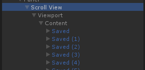

Unity的Scroll View的滑动距离和内容的高宽有关，所以当向Grid Layout Group里添加子控件的话，如果不改变Grid Layout Group的高宽将不能滑动到底部，所以我们需要Grid Layout Group的高宽可以自增。

RectTransform设置为顶部对齐

``` csharp
using UnityEngine;
using UnityEngine.UI;
using System.Collections;
public class AutoIncreaseLayout : MonoBehaviour {    
    private GridLayoutGroup layout;    
    private int childCount;    
    private RectTransform rectTransform;    
    // Use this for initialization    
    void Start () {        
        layout = GetComponent<GridLayoutGroup> ();        
        childCount = transform.childCount;        
        rectTransform = GetComponent<RectTransform> ();        
        rectTransform.sizeDelta = new Vector2 (0, Mathf.CeilToInt((float)childCount / (float)layout.constraintCount) * (layout.cellSize.y + layout.spacing.y));    
    }        
    // Update is called once per frame    
    void Update () {        
        if (transform.childCount != childCount) {            
            childCount = transform.childCount;            
            rectTransform.sizeDelta = new Vector2 (0, Mathf.CeilToInt((float)childCount / (float)layout.constraintCount) * (layout.cellSize.y + layout.spacing.y));        
        }    
    }
}
```
---
使用Unity UI自带功能实现：
1.添加一个Scroll View控件



2.在Content中添加Grid Layout Group和Content Size Fitter组件

3.将Content Size Fitter组件的Horizontal Fit和Vertical Fit的值改为Preferred Size


4.这时候向Content中添加子控件就会自动增加Content的高度


