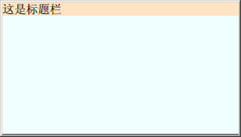

在WPF中自定义窗体标题栏，首先需要将窗体的WindowStyle属性设置为None，隐藏掉WPF窗体的自带标题栏。然后我们可以在窗体内部自定义一个标题栏，比如标题栏如下:

**\[html\]** [view
plain](http://blog.csdn.net/iispring/article/details/6888482# "view plain"){.ViewSource} [copy](http://blog.csdn.net/iispring/article/details/6888482# "copy"){.CopyToClipboard}

1.  &lt;Grid Grid.Row=" 0" x:Name="TitleBar" MouseMove="TitleBar\_MouseMove" &gt;  
2.              &lt;TextBlock Text="这是标题栏" FontSize="15" /&gt;  
3.  &lt;/Grid&gt;  

注意，我们给TitleBar添加了MouseMove事件，后台处理代码:

**\[csharp\]** [view
plain](http://blog.csdn.net/iispring/article/details/6888482# "view plain"){.ViewSource} [copy](http://blog.csdn.net/iispring/article/details/6888482# "copy"){.CopyToClipboard}

1.  private void TitleBar\_MouseMove(object sender, MouseEventArgs e)  
2.          {  
3.              if (e.LeftButton == MouseButtonState.Pressed)  
4.              {  
5.                  this.DragMove();  
6.              }  
7.          }  

\
如果没有为自定义的TitleBar添加MouseMove事件，那么就无法拖动窗体。

当然我写的这个标题栏比较简单，只是为了演示，大家可以扩充，根据需求放置最大化、最小化、关闭按钮等。\
\

前台所有代码:

**\[csharp\]** [view
plain](http://blog.csdn.net/iispring/article/details/6888482# "view plain"){.ViewSource} [copy](http://blog.csdn.net/iispring/article/details/6888482# "copy"){.CopyToClipboard}

1.  &lt;Window x:Class="WpfStudy.Window1"  
2.      xmlns="http://schemas.microsoft.com/winfx/2006/xaml/presentation" WindowStyle="None"  
3.      xmlns:x="http://schemas.microsoft.com/winfx/2006/xaml"  WindowStartupLocation="CenterScreen" Topmost="False"  
4.      SizeToContent="WidthAndHeight"     &gt;      
5.      &lt;Grid &gt;         
6.          &lt;Grid.RowDefinitions&gt;  
7.              &lt;RowDefinition Height="Auto"/&gt;  
8.              &lt;RowDefinition Height="150"/&gt;  
9.          &lt;/Grid.RowDefinitions&gt;  
10.         &lt;Grid.ColumnDefinitions&gt;  
11.             &lt;ColumnDefinition Width="300"/&gt;             
12.         &lt;/Grid.ColumnDefinitions&gt;  
13.         &lt;Grid Grid.Row=" 0" x:Name="TitleBar" Height="Auto" MouseMove="TitleBar\_MouseMove" Background="Bisque"&gt;  
14.             &lt;TextBlock Text="这是标题栏" FontSize="15" /&gt;  
15.         &lt;/Grid&gt;  
16.         &lt;Grid Grid.Row=" 1" Background="Azure"&gt;&lt;/Grid&gt;          
17.     &lt;/Grid&gt;  
18. &lt;/Window&gt;  

\
效果图:

\

这个示例够简单了，实在是不能再简化了\~\~

\

来源： <http://blog.csdn.net/iispring/article/details/6888482>

