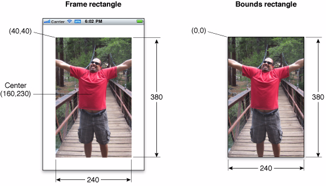

1、UIView的简介
---------------

UIView类（视图类）负责管理屏幕上的一块矩形区域，包括这个区域内的显示样式，比如背景颜色，大小，以及行为动作，例如监测用户点击等触碰事件。

视图还可以用于管理一个或者多个子视图。用户看到的某个样式，有可能是多个视图叠加后的显示效果。视图的这种布局方式，也称为视图层次，一个父视图可以包含任意多个子视图。同时，父视图的属性有时也会影响到子视图的样式以及用户交互行为。

总体来讲，视图类的主要作用有如下3个方面：

-   样式显示与动画：负责自身矩形区域内样式的显示，以及某些属性（大小、位置、角度）变化时的动画过渡效果；(CALayer)
-   布局与子视图管理：管理子视图(addSubView)
-   事件处理：接收触摸事件。(UIResponder)

在iOS开发中，UIView与UIViewController紧密协作，UIViewController负责UIView的加载与卸载。有关UIViewController的介绍，可以参考UIViewController相关教程：[UIViewController介绍：1-创建控制器](http://www.hcios.com/archives/731)

2、Frame/Bounds/Center
----------------------

``` prettyprint
@property(nonatomic) CGRect            frame;@property(nonatomic) CGRect            bounds; @property(nonatomic) CGPoint           center; 
```

Frame、Bounds以及Center是用来设置视图对象位置以及大小的属性，在对任何视图类对象进行初始化之后，建议大家紧接着就要去设置视图对象的Frame属性。在学习过程中，Frame、Bounds以及Center的区别和联系是比较难以理解的，主要是对视图的坐标系要有深刻理解，但对于初学者来说，可以记住如下要点即可：

-   绝对坐标系：屏幕的左上角是坐标原点（0，0）；横向为X轴，纵向为Y轴；向左边移动X值减小，向右边移动X值增加；向下边移动Y值增加，向上边移动Y值减小；
-   每个视图的起始位置和大小由Frame来确定，frame是一个CGRect类型的属性，CGRect是一个结构体，里面有两个变量origin和size，其中origin是一个CGPoint点，指的是视图左上角的那个点的位置，决定了视图的位置；size是CGSize类型的，决定了视图的大小；
-   Frame：视图在其父视图坐标系中的位置和大小，建议大家在控件初始化之后，紧接着就去设置Frame，设置完成后，假如涉及到修改控件的位置、大小等，就不要再去修改Frame了；
-   Bounds：视图在其自己的坐标系中的位置和大小。Bounds属性中，视图的bounds.origin始终是（0，0），因此bounds属性最核心的作用是设置视图的大小，即bounds.size，当需要去修改视图大小的时候，可以修改bounds.size；
-   Center：视图中心点在父视图坐标系中的坐标，当需要修改视图对象的位置时，可以修改Center属性。

[](http://7xow65.com1.z0.glb.clouddn.com/wp-content/uploads/2016/01/frame_bounds_rects.jpg)

视图的变形
----------

> 在开发过程中，经常需要对视图对象的样式进行修改，常见的修改操作有位移、放大/缩小、旋转等。当涉及到视图位移的时候，可以修改视图的center以及frame属性；当涉及到视图的缩放以及旋转操作时，推荐修改视图的transform属性。

当需要修改视图对象的大小时，有两种方法可以完成，第一种方法可以修改视图对象的bounds.size属性，第二种方法是直接修改视图对象的transform属性，即让视图对象进行一次形变操作。在修改形变属性时，需要使用到如下的函数，其中：sx以及sy是在X轴以及Y轴两个方向上放大的比例。

``` prettyprint
CG_EXTERN CGAffineTransform CGAffineTransformScale(CGAffineTransform t,  CGFloat sx, CGFloat sy) CG_AVAILABLE_STARTING(__MAC_10_0, __IPHONE_2_0);
```

下面的示例代码，实现分别在X轴和Y轴方向放大1.1倍。

``` prettyprint
- (IBAction)scale:(id)sender {    self.myView.transform = CGAffineTransformScale(self.myView.transform, 1.1, 1.1);    NSLog(@"myview frame :%@",NSStringFromCGRect(self.myView.frame));}
```

通过修改视图对象的transform属性，可以实现视图的顺时针旋转以及逆时针旋转，此时需要使用到如下函数，其中，angle属性是旋转的角度。

``` prettyprint
CG_EXTERN CGAffineTransform CGAffineTransformRotate(CGAffineTransform t,  CGFloat angle) CG_AVAILABLE_STARTING(__MAC_10_0, __IPHONE_2_0);
```

下面的示例代码，实现了顺时针旋转45度。

``` prettyprint
- (IBAction)rotate:(id)sender {    self.myView.transform = CGAffineTransformRotate(self.myView.transform,M_PI_4);    NSLog(@"myview frame :%@",NSStringFromCGRect(self.myView.frame));}
```

当需要重置transform属性时，可以进行如下设置。但要注意的是：假如需要完全重置一个视图的样式，除了重置transform属性之外，还需要重置frame, center, bounds。

``` prettyprint
- (IBAction)reset:(id)sender {    self.myView.transform = CGAffineTransformIdentity; }
```

视图关系的常用属性和方法
------------------------

``` prettyprint
/*常用属性*/@property(nullable, nonatomic,readonly) UIView       *superview;//父视图@property(nonatomic,readonly,copy) NSArray *subviews;//所有的子视图@property(nullable, nonatomic,readonly) UIWindow     *window;//视图所在的Window /*常用方法*/- (void)addSubview:(UIView *)view;//添加子视图- (void)bringSubviewToFront:(UIView *)view;//把某个子视图移到最前显示- (void)sendSubviewToBack:(UIView *)view;//把某个子视图移动到最后显示- (void)removeFromSuperview;//从父视图中移除
```

[](http://www.hcios.com/archives/1549)

1、UIView类中支持动画的属性
---------------------------

动画为用户界面在不同外观状态之间的迁移过程提供了流畅的视觉效果，动画播放的功能也是苹果自家的看家本领。在UIView类中，支持动画的属性如下所示，即：在开发过程中，修改如下属性，可以考虑添加动画效果。

``` prettyprint
/*UIView中可以添加动画的属性*/@property(nonatomic) CGRect            frame;@property(nonatomic) CGRect            bounds;@property(nonatomic) CGPoint           center; @property(nonatomic) CGAffineTransform transform;@property(nullable, nonatomic,copy)            UIColor          *backgroundColor; @property(nonatomic)                 CGFloat           alpha;
```

2、常用动画播放的方法
---------------------

当需要播放动画时，经常使用如下的类方法，在如下的方法中，可以设置动画播放的时间，动画播放的内容以及动画播放完毕后的操作。动画也可以支持嵌套。

``` prettyprint
/*UIView有关动画的属性和方法*/+ (void)animateWithDuration:(NSTimeInterval)duration animations:(void (^)(void))animations completion:(void (^ __nullable)(BOOL finished))completion NS_AVAILABLE_IOS(4_0); + (void)animateWithDuration:(NSTimeInterval)duration animations:(void (^)(void))animations NS_AVAILABLE_IOS(4_0);
```


