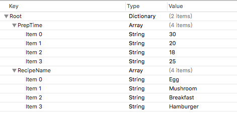

新家一个plist结构如下



读取plist中的数据

``` prettyprint
NSString *path = [[NSBundle mainBundle] pathForResource:@"recipes" ofType:@"plist"];
NSDictionary *dict = [[NSDictionary alloc] initWithContentsOfFile:path];
tableData = [dict objectForKey:@"RecipeName"];
prepTime = [dict objectForKey:@"PrepTime"];
```


