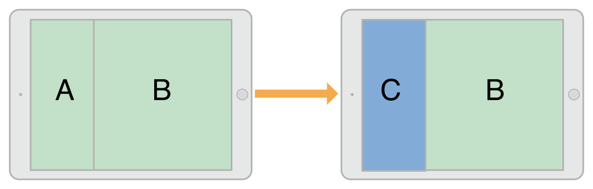

呈现一个视图控制器会在原始视图控制器，被称为presenting view controller 和要被显示的新的视图控制器，被称为presented view controller创建一个关系。这种关系构成了视图控制器层次结构的一部分，并且一直存在直到presented view controller撤销。

呈现和过渡
----------

### 呈现样式

通过设置UIViewController的modalPresentationStyle属性来改变ViewController呈现的样式。modalPresentationStyle为枚举类型

typedef enum UIModalPresentationStyle : NSInteger {   UIModalPresentationFullScreen = 0,   UIModalPresentationPageSheet,   UIModalPresentationFormSheet,   UIModalPresentationCurrentContext,   UIModalPresentationCustom,   UIModalPresentationOverFullScreen,   UIModalPresentationOverCurrentContext,   UIModalPresentationPopover,   UIModalPresentationNone = -1 } UIModalPresentationStyle;

其中全屏呈现样式有UIModalPresentationFullScreen,UIModalPresentationPageSheet 和 UIModalPresentationFormSheet：

以弹出形式呈现UIModalPresentationPopover：

当前上下文形式UIModalPresentationCurrentContext，要使用这种形式，可以通过设置definesPresentationContext属性为YES来指定哪个view controller被覆盖：

自定义的呈现形式UIModalPresentationCustom，通过继承自UIPresentationController，实现其中的方法来自定义呈现的view controller的动画和设置大小和尺寸

### 过渡样式

设置modalTransitionStyle属性可以改变你要呈现的view controller的过渡样式。当呈现这个view controller时，UIKit会创建与过渡样式相应的动画。该枚举类型有：

typedef enum UIModalTransitionStyle : NSInteger {   UIModalTransitionStyleCoverVertical = 0,   UIModalTransitionStyleFlipHorizontal,   UIModalTransitionStyleCrossDissolve,   UIModalTransitionStylePartialCurl, } UIModalTransitionStyle;

下图展示了一种向上滑动的过渡动画(UIModalTransitionStyleCoverVertical)来呈现view controller到屏幕上。

呈现一个视图控制器
------------------

有多种方式来呈现一个view controller：

-   使用segue来自动呈现view controller。segue根据你在Interface Builder中的设置来初始化并且呈现一个view controller。

-   使用showViewController:sender: 和 showDetailViewController:sender: 方法，这两种方法一般用在容器view controller呈现子view controller。

-   使用presentViewController:animated:completion: 方法用来以模态方式呈现view controller。

撤销一个呈现的视图控制器
------------------------

通过调用presenting view controller的dismissViewControllerAnimated:completion:方法来撤销一个presented view controller。你也可以调用presented view controller的这个方法。当你在presented view controller调用这个方法时，UIKit自动发送这个请求到presenting view controller。

