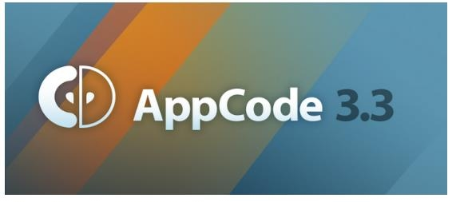
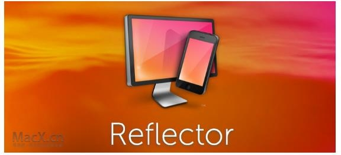

iOS开发者必备的10款工具
=======================

2015年11月25日 15:38  CCTIME飞象网  

当前iOS和Android两大移动操作系统“二足鼎立”，几乎覆盖了市面上大部分的智能[手机](http://www.cctime.com/)。相比Android，iOS开发适配更简单，且随着各种实用工具和Swift语言的出现，iOS开发门槛地降低，开发前景巨大。而对于开发者和设计师来说，是否拥有一款功能强大且实用的开发工具将直接影响其工作效率和成果。为此，我们结合现有资讯、整合最新资源，从开发、设计、分析、内测分发等方面整理出“iOS开发者必备的十款工具”供大家参考。

**开发环境：**

**1)Xcode**

作为苹果公司的当家IDE(IDE是Integrated Development Environment的缩写，意为“集成开发环境”)，Xcode早已为广大iOS开发者所熟知。Xcode 具有统一的用户界面设计，编码、测试、调试都在一个简单的窗口内完成;是开发OS X 和 iOS 应用程序的最快捷的方式。不管你用C、C++、Objective-C或Java编写程序，在AppleScript里编写脚本，还是试图从另一个奇妙的工具中转移编码，你会发现 Xcode 编译速度极快。每次操作都很快速和轻松：特别是模拟器超快，调试方便，设计高端，且直接发布App Store;是当前最好的IDE之一。

**2)AppCode**

除了使用Xcode来开发iOS应用，你也可以选择AppCode这款由JetBrains制作的IDE。JetBrains是一家捷克的公司，是IT界的IDE大户。他们开发了好多著名的IDE，比如IntelliJ IDEA，是java语言开发的集成环境，IntelliJ在业界被公认为最好的java开发工具之一。

AppCode是JetBrains用以替代的Xcode的一款产品， 是一个全新的 Objective-C 的集成开发环境，用于帮助开发 Mac、iPhone 和 iPad 的应用程序，早在2011年，AppCode就崭露头角并被广大开发者所喜爱。主要拥有以下特性：超乎想象和便利的代码导航以及代码自动完成、即时代码分析和快速简易、代码搜索，包括类、方法、变量和资源、即时代码转换，支持i18以及更为简洁高效的代码重构。

**图标设计：**

**1)Slicy**

作为IOS开发者，我们往往需要为程序准备两套图片资源，以应对低清屏和Retina屏的不同需求，随之而来的是切图工作量的成倍增加。Slicy是MacRabbit公司的跨世纪经典之作，可谓是iOS设计师必备一款的切图神器，旨在帮助设计师解决在切图上的烦恼。

Slicy操作十分简单，设计师只要把PSD文件(著名的图像处理软件Photoshop生成的专有格式)拖进Slicy的窗口，Slicy就会自动生成.jpg和.png等格式的切图文件，除此之外，Slicy还能够把普通像素的图片转换成视网膜像素的高品质图片。

**2)Prepo**

Prepo基于Mac和iOS的一款免费且方便的图标转化器，它可以帮助设计师快速的导出各种尺寸的图标。设计师通过Prepo把任何格式的图片文件转换成iOS可用的图片格式。此外，通过点击Prepo对话框底部“copy plist”按钮，设计师可以轻松的把导出的文件复制到Xcode中，节省了设计师大量的工作时间。

**原型设计：**

**1)Indigo Studio**

Indigo Studio 是由infragistics 开发的一款 UI原型设计和交互设计工具。帮助你快速而简单地创建活生生的UI原型。它的每一步都保持以用户体验为中心，有了Indigo Studio你可以用超过100个不同的场景、线框(内置交互控件以及桌面、网站和移动应用的原型)创建脚本，全部不需要代码。

与大多数的原型设计工具不同，Indigo Studio将交互设计视为其核心。其他工具只侧重于提供静态的UI实体模型设计和基本链接能力，如Axure等流行的原型设计软件，让原型设计师或UI开发者花费大量时间以不同的增加链接的方式实现交互设计。Indigo Studio却可以对每一个元素每一个按钮进行交互设计，并能够为交互动作设计丰富的过渡动画效果。他还支持设计注释和分享，大大的团队设计的工作效率。

**2)PaintCode**

PaintCode 是一款面向 iOS 和 Mac 应用开发者及设计师的矢量图形可视化开发工具，通过这款软件即使没有编程经验的设计师也能画出美丽的控件、图标或其他 UI 元素。

在开发过程中，设计一个有吸引力的、与分辨率自适应的UI是很困难和繁琐的事情，尤其是你需要编写图像代码的时候更是如此。PaintCode便可实时地将你编辑的矢量图转化为Objective-C和C\#/MonoTouch图像代码，使你不必再为了达到预期效果一遍遍地调整和重新编译代码，节省了大量的开发时间。

作为一款个性十足且用户体验超棒的Mac应用，PaintCode是iOS开发者不能忽视的开发工具，也正因如此，许多开发者将其称为设计与开发通吃的代码神器。

**测量工具：**

**xScope**

xScope是一款专门为设计师和开发人员创建、集八种功能于一体的多功能软件，是一套集测量、检查和测试屏幕上图形和布局的理想工具。这款工具来自开发商 Iconfactory，这家开发商也是知名推特开发商 Twitterrific 的开发商。xScope可以帮助设计师或开发人员更好更为准确的完成工作。xScope功能包括：度量距离和角度、放大镜、精准的水平和垂直对齐标记、精准的宽高度与原点对齐标记等;帮助您更快地工作和产出更精准的结果，让每个设计者快速，精确的完成工作。

**演示工具：**

**Reflector**

Reflector现在叫Reflector 2，前身是Reflection。是一款通过 AirPlay 功能直接将 iPhone/iPod Touch/iPad等iOS设备的屏幕镜像直接输出至 OS X 系统的实用小工具。Reflector最初是由微软员工Lutz Roeder编写的免费程序，它出现使·NET程序员眼前豁然开朗，因为这个免费工具可以将·NET程序集中的中间语言反编译成C\#或者Visual Basic代码。利用AirPlay 和 Mac OS X，Reflector允许用户在Mac显示屏上实时查看iOS设备的屏幕，无需进行任何设置。用户可以将屏幕上的活动记录并保存 到电脑上。用户甚至还可以在iMac大屏上体验iOS游戏。

**分析统计：**

**Flurry Analytics**

Flurry Analytics是个免费的移动应用数据分析平台，可应用于iOS、 Android、Windows Phone、HTML5、Hybrid应用、移动Web、 BlackBerry和JavaME。Flurry Analytics不仅免费，而且专业。Flurry Analytics平台不断添加尖端功能和广泛的大数据，拥有先进的自定义分割以及转换跟踪功能。其次，通过创建事件，让您了解如何让您的应用发挥独特的作用，事件设置简单，并且还可以跟踪和您的应用程序相关的任何东西。Flurry Analytics还具有大数据优势，并直接将大数据为您转化为独特的，功能强大的见解。

**内测分发：**

**Pre.im**

自去年苹果收购了TestFlight的开发商Burstly之后，宣布关闭TestFlightApp.com上面的老版本TestFlight，于是TestFlight作为独立测试平台的身份宣告结束，与国内的开发者渐行渐远。

然而今天我们要重点介绍的是一款一直于与Testflight并驾齐驱的行业后起之秀——Pre.im.这是一款由全球最大APP及手游云测试服务商Testin推出的内测分发及应用托管免费工具。Pre.im 提供的服务包括免费应用测试、托管、分发平台，并免费进行iOS企业证书签名。它以极简操作，超速上下传，帮助开发者将开发完的应用最快速到达用户手中，让开发者和用户一起体会到应用的快乐。

Pre.im的一大亮点是使用简便：上传App，用户扫描二维码下载应用，分发就两步，iOS手游也不例外，UDID傻瓜式获取;告别应用商店漫长无比的审核等待，让应用闪电到达内测用户手中。另外，Pre.im会持续为开发者提供免费的iOS企业签名打包服务。对于小型的创业团队来说，购买企业证书也是笔不小的投入。通过Pre.im的这一服务，可以省却这份资金，而且操作简单：在应用上传时，打开“使用企业签名”开关即可。

除了先前不同于TestFlight只服务iOS用户外，Pre.im此次还针对Android用户推出了免费真机兼容测试服务。不仅如此，还添加包括摇一摇反馈、崩溃分析以及应用合并等崭新功能。不得不说随着行业需求的发展，Pre.im注定是一款开发使用前景巨大的内测工具。

[站长统计](http://www.cnzz.com/stat/website.php?web_id=1753476 "站长统计")
