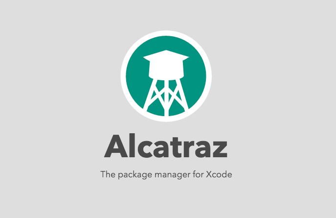
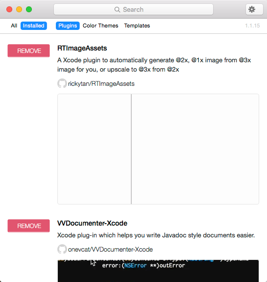

> 古人云“工欲善其事必先利其器”，打造一个强大的开发环境，是立即提升自身战斗力的绝佳途径！Xcode虽然功能强大，但是借助一些辅助插件可以极大的提升开发效率。

1、Xcode插件管理工具–Alcatraz的安装 {#xcode插件管理工具alcatraz的安装 style="max-width: 100%;"}
-----------------------------------

Alcatraz是针对Xcode的一款插件管理器，通过Alcatraz可以非常方便的管理插件，包括安装、删除、升级等操作。

[{width="687"
height="445"}](http://7xow65.com1.z0.glb.clouddn.com/wp-content/uploads/2015/12/QQ20151221-1.png)

[官方网站](http://alcatraz.io/)

安装方法一（推荐）：

-   完全关闭Xcode；
-   如果之前安装过该插件，请执行下面的命令删除；

``` {style="max-width: 100%;"}
rm -rf ~/Library/Application\ Support/Developer/Shared/Xcode/Plug-ins/Alcatraz.xcplugin
```

-   执行如下命令，期间有可能需要输入当前mac用户的密码；

``` {style="max-width: 100%;"}
find ~/Library/Application\ Support/Developer/Shared/Xcode/Plug-ins -name Info.plist -maxdepth 3 | xargs -I{} defaults write {} DVTPlugInCompatibilityUUIDs -array-add defaults read /Applications/Xcode.app/Contents/Info DVTPlugInCompatibilityUUID sudo xcode-select --reset
```

-   执行如下指令，安装插件。

``` {style="max-width: 100%;"}
curl -fsSL https://raw.github.com/supermarin/Alcatraz/master/Scripts/install.sh | sh
```

-   启动Xcode，会显示提示框，选择“Load Bundles”。

安装方法二：

-   安装：打开命令行终端，复制如下代码，执行！（如果被墙，请使用VPN）

``` {style="max-width: 100%;"}
curl -fsSL https://raw.githubusercontent.com/supermarin/Alcatraz/deploy/Scripts/install.sh | sh
```

-   安装成功后，打开Xcode，选择window-&gt;Package
    Manager，打开Alcatraz。

[{width="545"
height="575"}](http://7xow65.com1.z0.glb.clouddn.com/wp-content/uploads/2015/12/QQ20151221-2.png)

-   删除：打开命令行终端，复制如下代码，执行，可以删除Alcatraz！

``` {style="max-width: 100%;"}
rm -rf ~/Library/Application\ Support/Developer/Shared/Xcode/Plug-ins/Alcatraz.xcplugin
```

-   删除所有缓存的数据

``` {style="max-width: 100%;"}
rm -rf ~/Library/Application\ Support/Alcatraz
```

2、Xcode常用插件推荐 {#xcode常用插件推荐 style="max-width: 100%;"}
--------------------

-   <span style="max-width: 100%;">VVDocumenter 规范注释生成器</span>

针对方法可以输入///，即可自动补齐符合规范的注释，可以识别方法的功能、参数以及返回值。

-   <span
    style="max-width: 100%;">FuzzyAutocompletePlugin代码自动补全</span>

FuzzyAutocompletePlugin通过添加模糊匹配来提高Xcode代码自动补全功能，开发者无需遵循从头匹配的原则，只要记得方法里某个关键字即可进行匹配，很好地提高了工作效率。

-    XAlign 代码对齐

<span style="max-width: 100%;">XAlign</span> 是一个 Xcode
的实用插件，用于对齐规范代码。除了插件作者 qfish 提供的 3
种对齐格式，还可以自定义任意你想要的格式。

-   <span style="max-width: 100%;">KSImageNamed图片选择</span>

为项目中使用的UIImage的imageNamed提供文件名自动补全功能。使用\[UIImage
imageNamed:@”xxx”\]时，该插件会扫描整个workspace中的图片文件。

-   <span style="max-width: 100%;">CocoaPods</span>

非常方便的Xcode
pods插件。可以很方便的在Xcode通过pods安装各种objective-c第三方库，省去以前还要手动去跑pods命令行的麻烦；此外，还支持通过cocoaDocs来安装库文档。
