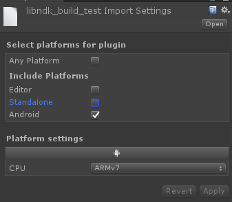

首先新建一个目录，作为我们的工程目录

在目录中创建一个名为Application.mk的文件，内容如下

```makefile
APP_ABI := armeabi  #指定平台
APP_STL := gnustl_static  #C++运行时库
APP_PROJECT_PATH := $(call my-dir)  #指定工程路径
APP_BUILD_SCRIPT := Android.mk  #指定Android.mk文件
APP_PLATFORM := android-17  #指定Android的API level
APP_OPTIM := debug  #调试开关
#NDK_BUILD_PATH := F:\\sdks\\android\\android-ndk-r10e  #NDK路径
#NDK_LIB_PATH := $(NDK_BUILD_PATH)/platforms/$(APP_PLATFORM)/arch-arm/usr/lib  #NDK库路径
```

接着创建一个名为Android.mk的文件，添加如下内容

```makefile
LOCAL_PATH := $(call my-dir)  #指定LOCAL_PATH为当前目录

include $(CLEAR_VARS)  #清理一些变量

LOCAL_MODULE := ndk_build_test  #编译模块名
LOCAL_SRC_FILES := $(LOCAL_PATH)/src/NDKBuildTest.cpp  #要编译的源文件

include $(BUILD_SHARED_LIBRARY)  #编译动态链接库
```

创建一个文件夹src，在里面创建一个名为NDKBuildTest.cpp的文件

```c++
extern "C" int Add(int a, int b)
{
	return a + b;
}
```

使用ndk-build构建so库，这里需要使用`NDK_PROJECT_PATH`指定工程目录和`NDK_APPLICATION_MK`指定Application.mk文件位置

```
ndk-build NDK_PROJECT_PATH=. NDK_APPLICATION_MK=Application.mk
```

将生成的so库导入到Unity工程的Plugins/Android中的相应平台目录，然后在Unity中调用

```c#
public class UnityPluginDebug : MonoBehaviour {
	[DllImport("ndk_build_test")]
    public static extern int Add(int a, int b);

	// Use this for initialization
	void Start () {
		Debug.Log("------------------" + Add(3, 4));
	}
}
```

**注意：**DllImport的时候需要加上去掉lib前缀，否则可能出现找不到库的情况

```
D/Unity   (22271): Unable to lookup library path for 'libname', native render plugin support disabled.  
E/Unity   (22271): Unable to find libname
```

如要导入libfoo.so库中的方法：

```c#
[DllImport("foo")]
```

**注意：**导入so库的时候如果使用默认设置可能会出现库找不到的情况

```
D/Unity   ( 7958): Unable to lookup library path for 'ndk_build_test', native render plugin support disabled.
E/Unity   ( 7958): Unable to find ndk_build_test
```

我们需要修改库的导入设置，如ARMv7平台的设置：



[Application.mk](https://developer.android.com/ndk/guides/application_mk?hl=zh-cn)

[Android.mk](https://developer.android.com/ndk/guides/android_mk?hl=zh-cn)

[ndk-build](https://developer.android.com/ndk/guides/ndk-build?hl=zh-cn)

[C++ 库支持](https://developer.android.com/ndk/guides/cpp-support?hl=zh-cn)

[unity-调用动态库so-android篇](https://blog.csdn.net/yangxuan0261/article/details/52420833)

[ndk-build生成.so](https://www.jianshu.com/p/6323f519480f)

[How to make Android native plugin working with Unity 4.5](https://answers.unity.com/questions/780006/how-to-make-android-native-plugin-working-with-uni.html)