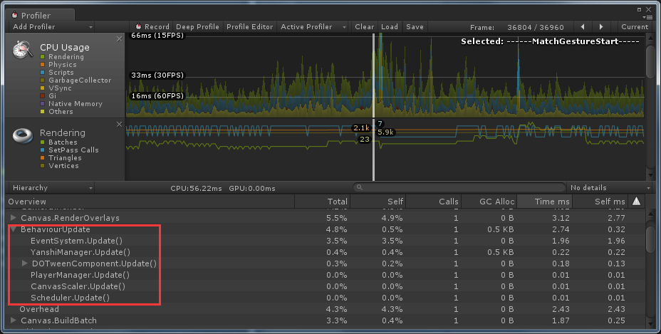
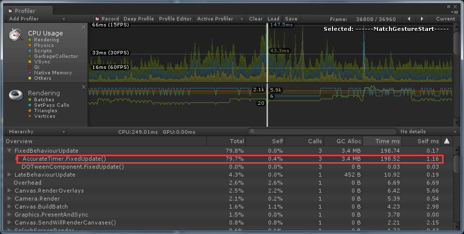
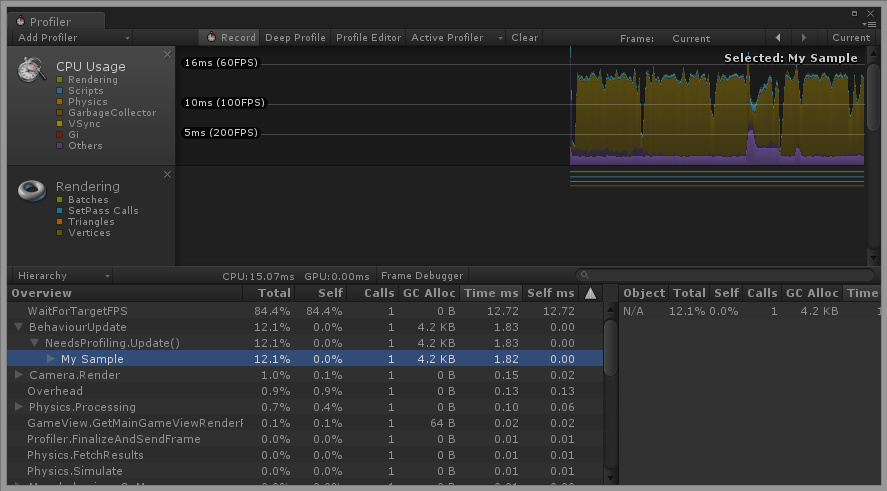

在Profiler中打开Deep Profile会导致很大的性能开销，拖慢运行速度，使得我们不能很好的评估性能，在移动平台上Deep Profile甚至不起作用，而不开Deep Profile我们无法定位消耗性能的方法，如下图，我们只能看到Update方法的开销，却不知道真正消耗性能的方法。

那么我们该怎么分析究竟是哪里消耗了性能呢？

首先我们先通过Profiler找到性能瓶颈，如



然后，我们自己要对里面调用到的方法进行评估，并在可能消耗性能较多的地方插入Profiler.BeginSample和ProfilerEndSample方法对（需要引用命名空间UnityEngine.Profiling）

```c#
using UnityEngine.Profiling;

public class NeedsProfiling : MonoBehaviour {
    void Update() {
        Profiler.BeginSample("My Sample");
        Debug.Log("This code is being profiled");
        Profiler.EndSample();
    }
}
```

重新运行程序，这时候Profiler中就会显示代码块的性能消耗了



[该如何分析一个特定代码块的性能](https://support.unity3d.com/hc/zh-cn/articles/210223933-%E8%AF%A5%E5%A6%82%E4%BD%95%E5%88%86%E6%9E%90%E4%B8%80%E4%B8%AA%E7%89%B9%E5%AE%9A%E4%BB%A3%E7%A0%81%E5%9D%97%E7%9A%84%E6%80%A7%E8%83%BD)