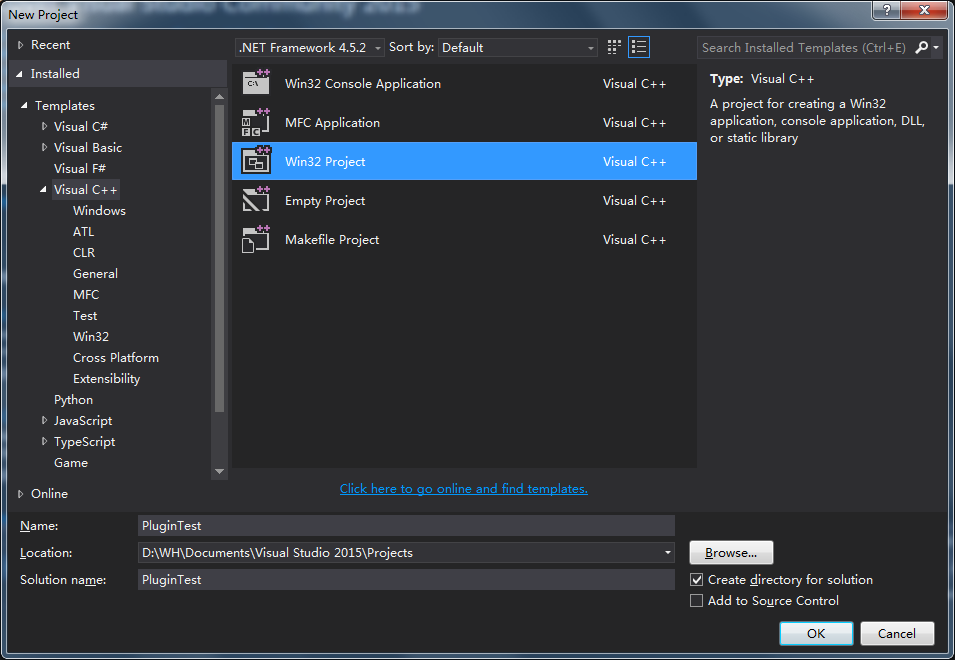
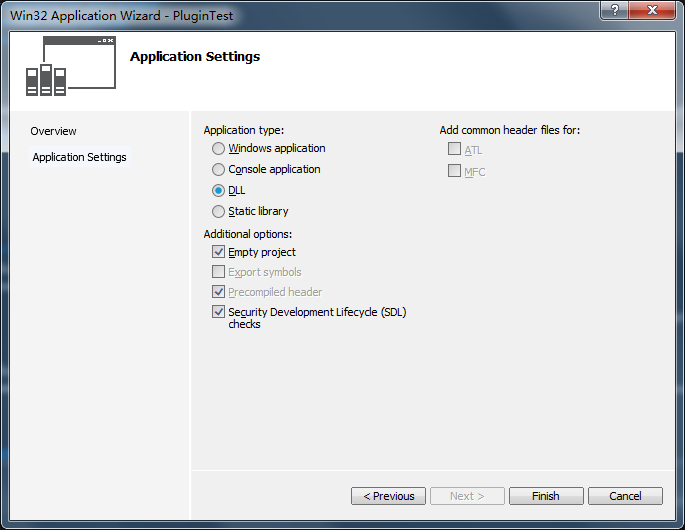
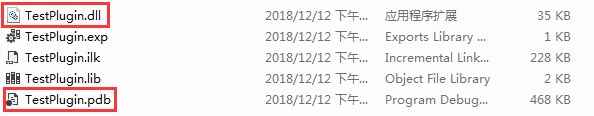
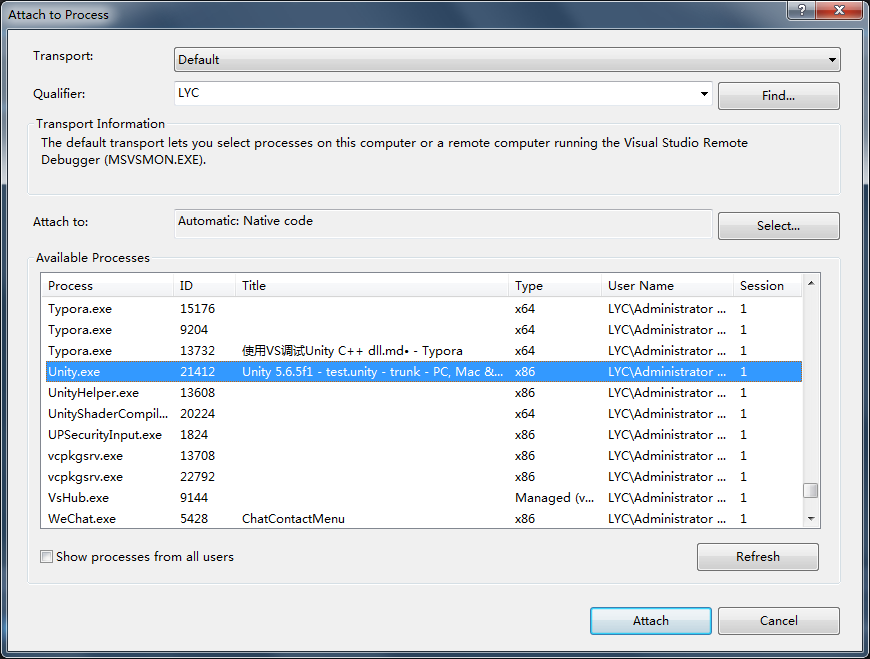
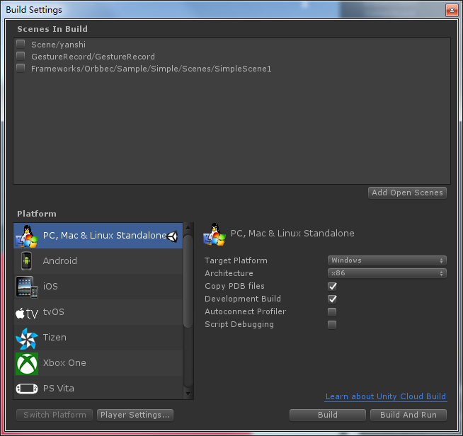

1. 创建新工程，这里需要选择Win32 Project

   

2. 在Project Settings页面选择DLL，并且勾选Empty project，点击Finish

   

3. 编译工程，并且将dll和pdb文件拷贝到Unity的Plugins目录下对应平台文件夹（pdb是调试文件，没有这个文件将无法进行断点调试）

   

4. 在VS中点击菜单Debug->Attach to Process...，在弹出窗口中找到Unity进程，然后点击Attach

   

5. 在工程中打好断点，然后点击Unity的Play，就可以进行断点调试了

6. 如果需要调试已发布的Windows平台工程，需要在Build Settings中勾选Copy PDB files

   

[使用 Visual Studio 调试器附加到运行的进程](https://docs.microsoft.com/zh-cn/visualstudio/debugger/attach-to-running-processes-with-the-visual-studio-debugger?view=vs-2015)

[Unity/C++混合编程全攻略！——基础准备](https://zhuanlan.zhihu.com/p/30746354)

[Unity and DLLs: C# (managed) and C++ (unmanaged)](https://ericeastwood.com/blog/17/unity-and-dlls-c-managed-and-c-unmanaged)