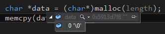
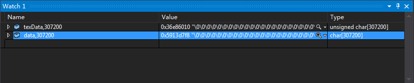

使用VS调试断点C++工程的时候，只能看到数组指针的第一个元素的内容，这是因为调试器不知道该数组的长度

如果我们想要查看数组所有元素的内容，可以在监视器中以["指针名","数组长度"]的方式来查看数组的全部内容

[如何在 Visual C++ 调试器监视窗口展开数组指针](https://support.microsoft.com/zh-cn/help/198953/how-to-expand-an-array-pointer-in-the-visual-c-debugger-watch-window)