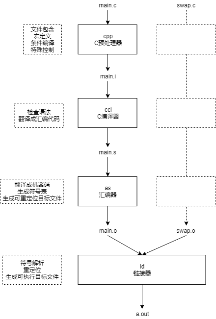

使用GCC编译源代码生成可执行目标文件可以分为四个阶段：

- 预处理（Preprocessing）
- 编译（Compilation）
- 汇编（Assembly）
- 链接（Linking）

如下图所示：



### 预处理

预处理阶段处理#include，宏定义，条件编译及其它特殊控制，如#error

使用gcc命令进行预处理

```
gcc -E main.c -o main.i
```

gcc的-E选项，可以让编译器在预处理后停止，并输出预处理结果。

其实真正执行命令的是C预处理器（cpp），上面的代码等同于

```
cpp main.c main.i
```

它将源程序main.c翻译成中间文件main.i

### 编译

编译阶段，将中间文件翻译成汇编代码，期间会进行语法检查

使用gcc命令进行编译

```
gcc -s main.i -o main.s
```

gcc的-S选项，表示在程序编译期间，在生成汇编代码后，停止，-o输出汇编代码文件。

真正执行变量命令的是C编译器（ccl）

```
ccl main.i main.c -O2 -o main.s
```

### 汇编

汇编阶段，将汇编代码翻译成机器码，并生产符号表，输出可重定位的目标文件

使用gcc命令进行汇编

```
gcc -c main.s -o main.o
```

真正执行命令的是汇编器（as）

```
as -o main.o main.s
```

### 链接

链接器将一个或多个可重定位的目标文件进行符号解析、重定位，再加上其它必要的文件如库文件最终生成一个可执行文件

```
gcc main.o swap.o -o a.out
```

真正实行这一步的是链接器（ld）

```
ld -o a.out main.o swap.o
```


[Linux GCC常用命令](https://www.cnblogs.com/ggjucheng/archive/2011/12/14/2287738.html)

深入理解计算机系统（第7章 链接）

