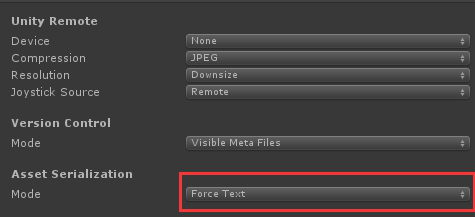
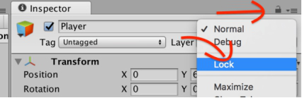
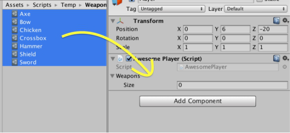
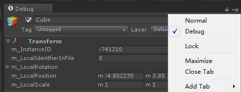
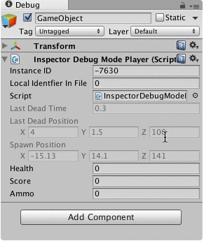
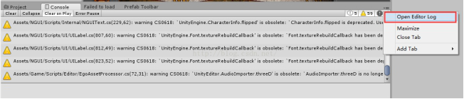
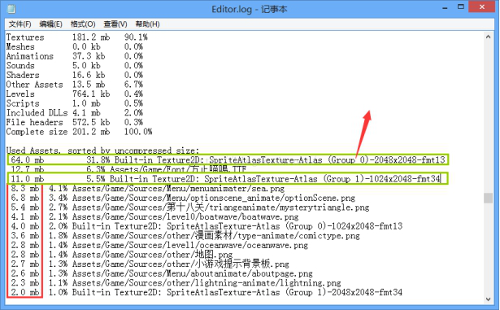
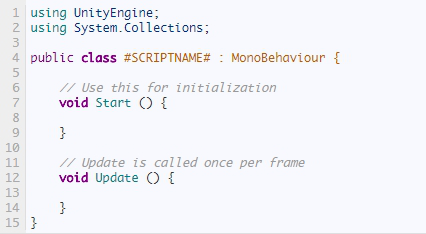

**设置资源的序列化方式**

新建一个工程时首先在Edit->Project Settings->Editor中设置VersionControl的Mode为ForceText，会将Unity的一些资源文件及meta文件序列化成文本而不是二进制文件，防止SVN提交时冲突，及方便文件合并。

 

 

**锁定面板**

如在查找资源时不像丢失当前打开的面板，可以设置锁定当前面板

 

**添加一组资源到数组中**

先锁定面板，再选中一组资源拖到面板的数组中

 

 

 

**Inspector窗口的Debug模式**

切换为Debug模式后可以看到脚本中private成员变量的值，方便调试

 

 

 

**调试的时候暂停游戏**

有时候希望在游戏运行到某一行代码的时候暂停游戏来查看游戏的状态或者某个变量的值，如果使用断点的话整个Unity是无法操作的，这种情况下就可以在代码中使用Debug.Break()来暂停游戏。

 

**Unity Asset Store下载文件夹**

从Unity Asset Store中下在的资源存放在：

C:\Users\UserName\AppData\Roaming\Unity\Asset Store

 

**Unity Crash之后恢复场景**

有时候会遇到Unity Crash但是工程又没来得及保存的情况，Crash之后在Temp文件夹中有会一个叫做"__EditModeScene"的文件是最后一次使用的场景，将它重命名为xxx.unity然后放到Unity工程中，打开这个场景就是Crash之前未保存的场景

 

**查看打包后的资源占用情况**

Unity打包之后在Unity Console界面右上角点开Open Editor Log，可以看到每种类型的资源占用情况及每个资源的详细情况

 

 

 

**保存Unity运行时GameObject的状态**

在运行的时候复制该GameObject，退出运行状态再粘贴该GameObject就是运行是GameObject的状态

 

**修改脚本模版**

Unity脚本模版存放在X:\Program Files\Unity\Editor\Data\Resources\ScriptTemplates中，默认情况下在Unity中新建一个脚本文件的模版如下

 

可以自行修改，如去掉自动生成Start和Update方法

 

**在Inspector中显示非public的成员变量**

```
[SerializeField]
protected int foobar = 0;
```


**在Inspector中隐藏public的成员变量**

```
[HideInInspector]
public float foobar = 1.0f;
```


**在Inspector中显示自定义的class或struct**

 ```
[System.Serializable]
public class FooBar 
{    
	public int foo = 5;    
	public int bar = 10;
}
 ```


 **同时选中多个对象编辑** 

`CanEditMultipleObjects` 

在Unity中同时选中多个GameObject的脚本进行属性编辑，Inspector会提示Multi-object editing not supported，需要加上这个属性

```
[CanEditMultipleObjects]
[CustomEditor(typeof(LevelScript))]
public class LevelScriptEditor : Editor 
{
    public override void OnInspectorGUI()
    {
        LevelScript myTarget = (LevelScript)target;
        
        myTarget.experience = EditorGUILayout.IntField("Experience", myTarget.experience);
        EditorGUILayout.LabelField("Level", myTarget.Level.ToString());
    }
}
```


**Unity启动时运行特定的脚本**

`InitializeOnLoad`

在Class上使用，可以在Unity启动的时候，运行Editor脚本。需要该Class拥有静态的构造函数。

```
[InitializeOnLoad]
public class ScriptExecuteOrderSetting
{
    static ScriptExecuteOrderSetting()
    {
        UnityEngine.Debug.Log("ScriptExecuteOrderSetting");
    }
}
```

`InitializeOnLoadMethod`

在Method上使用，是InitializeOnLoad的Method版本。Method必须是static的。


**Unity播放时自动运行脚本**

`RuntimeInitializeOnLoadMethod` 

不用挂载在任何物体上，游戏启动时自动运行，在Method上使用，Method必须是static的。


**自动添加依赖的脚本**

`RequireComponent`

当该Class被添加到一个GameObject上的时候，如果这个GameObject不含有依赖的Component，会自动添加该Component，且不可移除。


**一个GameObject中只允许存在一个相同的脚本**

`DisallowMultipleComponent`

继承MonoBehavior的类，在同一个GameObject上面，最多只能添加一个该类的实例。


**在Editor模式下执行MonoBehavior中的方法**

`ExecuteInEditMode`

默认状态下，MonoBehavior中的Start，Update，OnGUI等方法，需要在Play的状态下才会被执行。
这个属性让Class在Editor模式（非Play模式）下也能执行。


