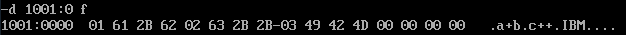

- R命令查看、改变CPU寄存器的内容

  查看寄存器内容

  

  修改寄存器AX中的值

  

- D命令查看内存中的内容

  查看内存10000H处的内容

  

  查看内存10010H~1001FH的内容

  

- E命令改写内存中的内容

  改写内存10020H处开始的内容

  

- U命令将内存中的机器指令翻译成汇编指令

  如将从10000H开始的内存单元中的内容翻译为汇编指令

  

- T命令执行一条机器指令

  先修改CS、IP中的内容使CS:IP指向1000:0，然后执行10000H处的指令

  

- A命令以汇编指令的格式在内存中写入一条机器指令

  从内存10000H开始写入一系列汇编指令

  